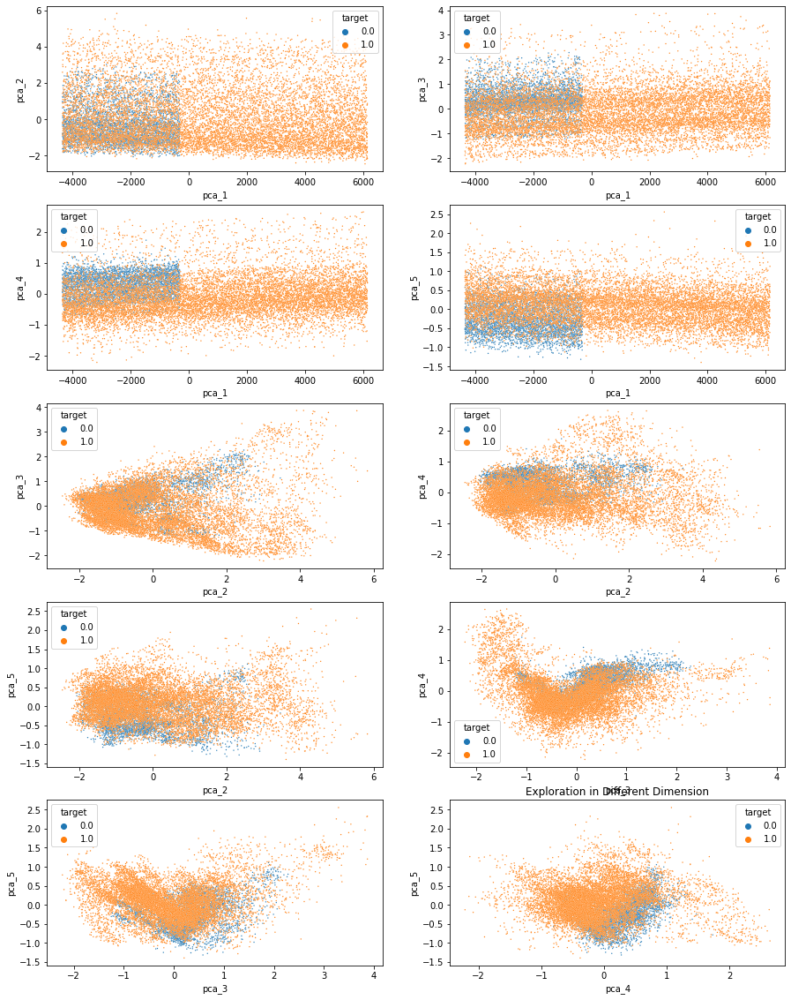
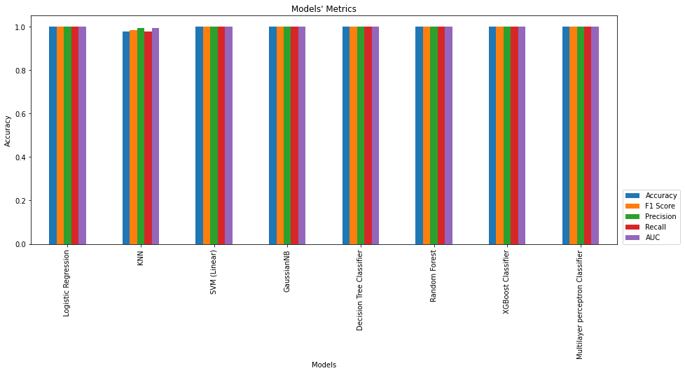

# Myocardial Infarcion Classification
### Data Comprehension and Initial Exploration
According to Kachuee M et al 2018, building an MI classification model was trained from the PTB dataset. In this module, PTB dataset was splitted by labeling as "ptbdb_abnormal.csv" and "ptbdb_normal.csv".
<hr>
In the article, they discussed that it was only Lead II used for model development.

Since, the Lead II represents only inferior wall, abnormal Lead II could be interpreted only as inferior-wall MI. This could make the model prediction misdiagnosis for anterior-wall or lateral-wall MI. Note that this model may be suitable for only diagnosis of inferior-wall MI.

# PCA


# Results of the models


# Discussion
> Logistic Regression, SVM, GaussianNB, Decision Tree, and XGBoost are the models that give 100% of accuracy from this dataset. Also, thier Mean Accuracies of Cross Validation are 100%.

> The "Multilayer Perceptron" Classifier report shows that Mean Accuracy of Cross Validation is less than other models above. So, to avoid life-threatening damage from 0.03% which means 3 patients from 10,000 patients, this model may not be the option for the prototype, for now.

> Therefore, to create prototype for this predictor, these models can be used to validate with other dataset in order to calibrate with each hospital or clinical practice.

> Since this dataset was retrieve from only one spec of ECG (according to https://www.physionet.org/content/ptbdb/1.0.0/ ECG specification), these model are needed to be calibrated to check if new inputs distribution shifted from the training dataset

> Note, again, that these model is only use to interpret Lead II.

```
## Ratio Normal/Abnormal ##
0.3851132686084142
 
## Percent of a minority class ##
27.80373831775701  %
````


> The dataset size ratio was 0.385 Normal/Abnormal, which is 27.8% of total size. It was a bit imbalanced, but no need to oversampling the data.

> According to the article https://towardsdatascience.com/smote-fdce2f605729, a metric "Accuracy" should not be used as a metric in case of imbalanced data. By doing SMOTE to balance the dataset, it will increase more prediction of the false positives, and reduce the false negatives. This means, increase "Recall", lower "Precision".

> However, in our case, the metrics show 100% of recall and precision. I think it just needs to be tested with other dataset to confirm its usability.


RUN ON COLAB: https://colab.research.google.com/drive/1Ykg3exKfDkhYYzWlVpGvG59mvc3R02iW?usp=sharing
